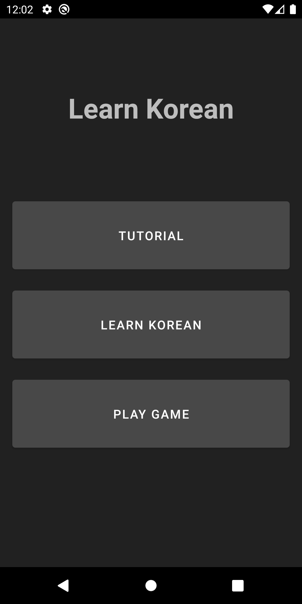
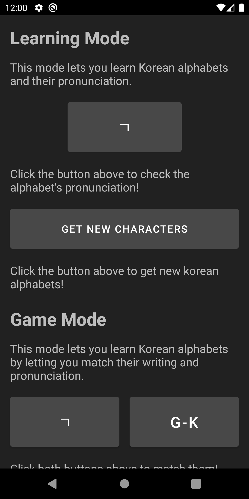
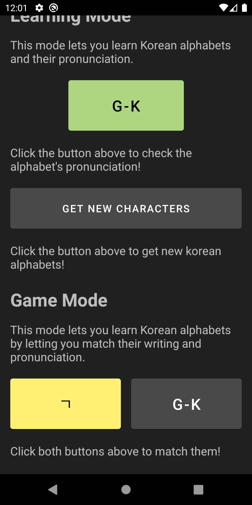
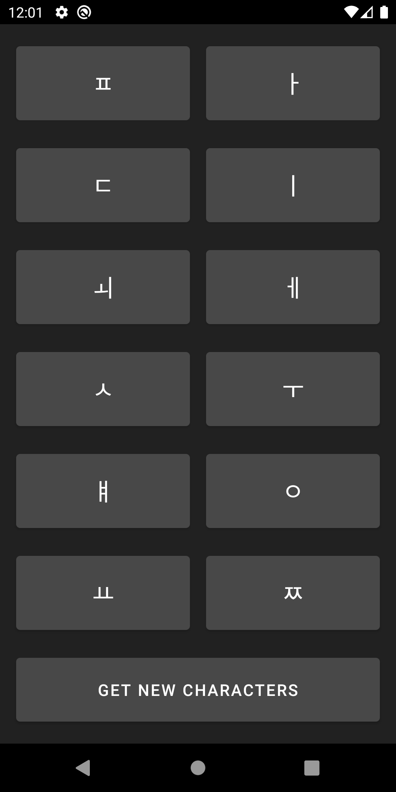
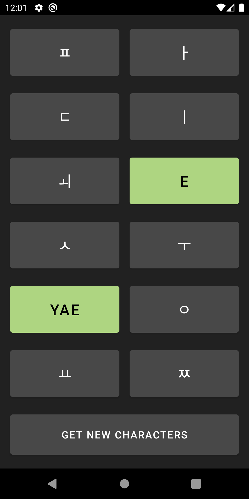
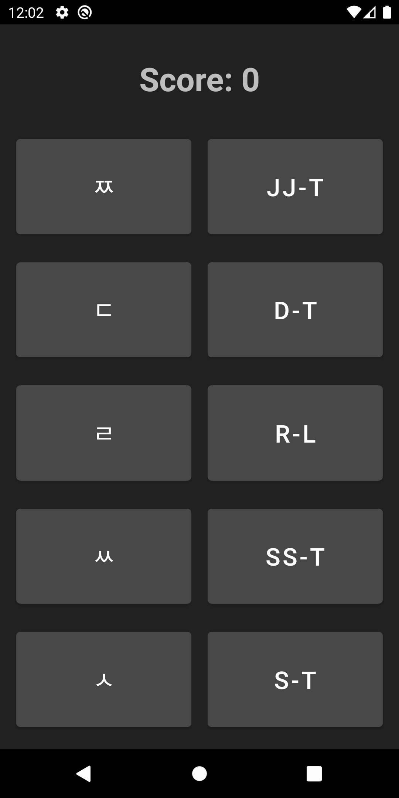
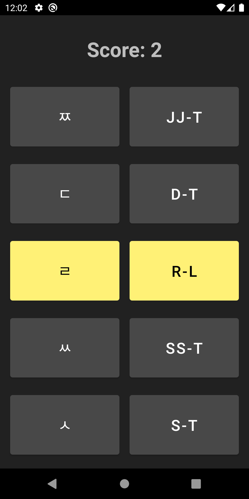

# Learn Korean - Andriod App

#### https://github.com/msukmoon/learn-korean

  

  
  

  
  

  
  

## Getting Started

This will be updated later.

### Running the Application

This will be updated later.

### Supplementary Documents

This will be updated later.

### Checking Source Codes

This will be updated later.

## Author

- **Myungsuk Moon** - [msukmoon](https://github.com/msukmoon) - jaymoon9876@gmail.com
